# 1 VoLTE基本特征
## 1.1 LTE语音解决方案与策略
+ CSFB：现阶段GSM/UMTS运营商当前通行的解决方案；
+ 双待机：作为一种终端形态出现并在一定阶段存在；
+ VoLTE/SRVCC：LTE达到一定覆盖时的目标方案；

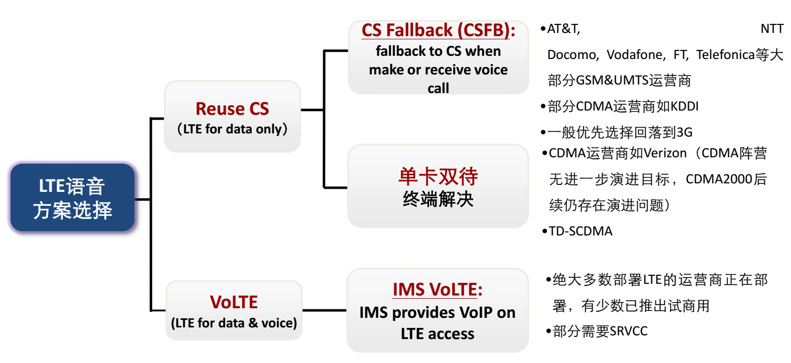

## 1.2 VoLTE定位
在VoLTE/SRVCC部署之前，运营商只能用窄带语音业务（CSFB或双待机）与互联网OTT竞争，面临挑战：
+ CSFB和双待机解决方案相对于GSM语音体验没有提升，还可能略差，无法应对LTE时代互联网OTT的巨大冲击（计费模式、用户体验、业务扩展性）；
+ CSFB和双待机方案依赖于GSM网络，多网长期共存，网络和运营复杂度高，难以实现2G优质频率资源的移植再用；

期望VoLTE能缓解以上两方面的挑战。
## 1.3 VoLTE基本特征
LTE覆盖达到一定程度时，VoLTE相对于CSFB和双待机解决方案，可以大幅降低语音业务对2G网络的依赖程度，有利于2G优质频点的再利用。
此外，VoLTE具有以下特征：
+ 1/2 呼叫时延：VoLTE时延1～3秒，2G/3G 5～9秒；
+ 10× 视频质量：可实现高质量视频，实现分辨率VGA、720P@帧率30fps的高质量视频通话体验（VoLTE：480×640，2G/3G： 176×144）；
+ 2× 话音质量：可实现高清语音，采用AMR-WB编解码，相比于现网AMR-NB编解码，频谱范围更宽，语音更自然、更有现场感，增加了可懂度和清晰度（LTE频率50～7000Hz，编解码 AMR-WB 23.85Kbps，2G/3G：300～3400Hz，编解码 AMR-NB 12.2Kbps）；
+ 3× 频谱效率：承载相同AMR语音，LTE的频谱效率高3倍以上；
# 2 VoLTE基本原理
## 2.1 VoLTE基本网络结构
VoLTE是通过TD-LTE网络作为业务接入、IMS网络实现业务控制的语音解决方案。VoLTE支持高清语音、高清视频等通信业务，同时可实现与现网2G/3G的语音互通：
+ 业务接入：LTE网络是全IP网络，没有CS域，数据业务和语音多媒体业务都通过LTE网络接入；
+ 业务控制：EPC网络不具备语音和多媒体业务的呼叫控制功能，需要通过IMS网络提供业务控制功能；
+ 业务切换：在LTE全覆盖之前，需要通过eSRVCC技术实现LTE与CS之间的语音业务连续性；

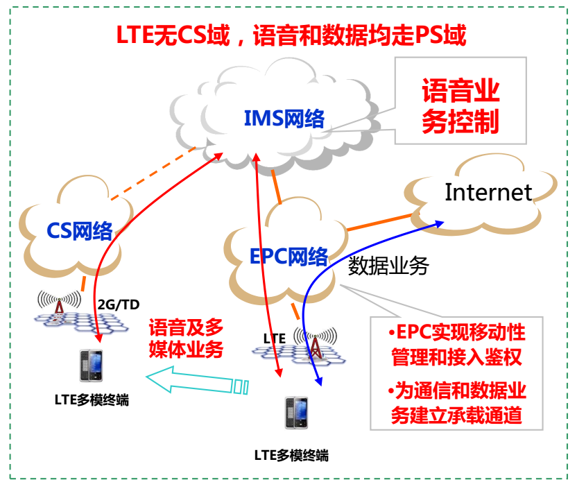
为了实现现有业务的继承性、一致性和业务连续性，现网需要进行较复杂的改造：
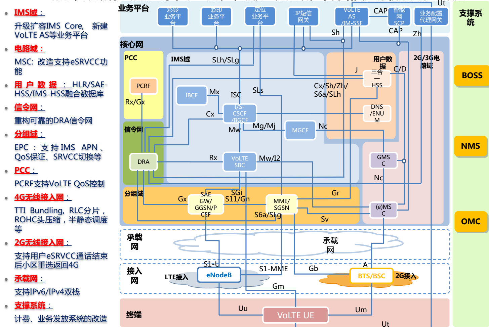
VoLTE的大脑是IMS。IMS的核心思想是将传统MSC的功能拆分为多个独立网元，可独立部署、独立升级，导致网元数量激增、接口激增，网络空前复杂。
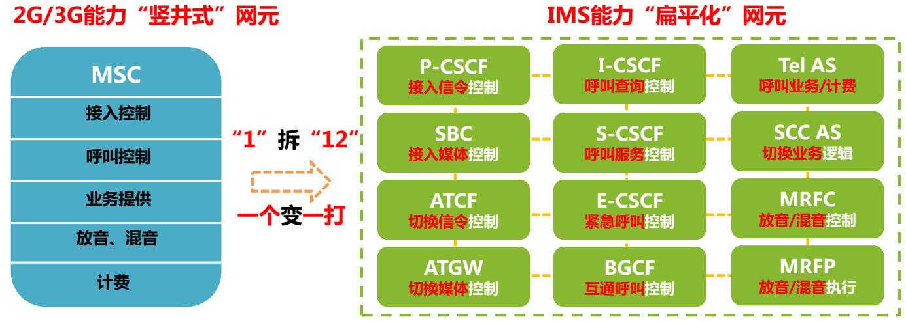
VoLTE涉及38个常用接口，最常用的28个，异厂家、异系统互联问题突出。
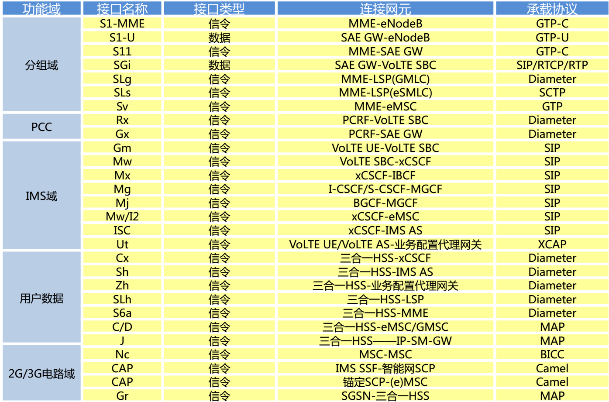

## 2.2 主要流程：
### 2.2.1 基本注册流程
注册是终端向签约网络请求授权使用业务的过程。VoLTE终端在VoLTE网络下，终端需要先附着到EPC网络，再完成IMS网络注册。

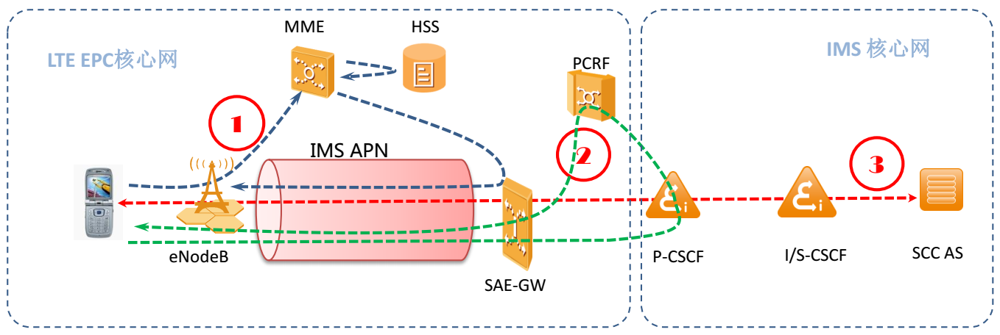

VoLTE用户注册包括三段基本信令过程：
+ 用户附着与数据默认承载建立： VoLTE终端开机后发起LTE附着过程后，将根据签约首先建立数据默认承载（APN = CMNET，QCI = 9）；
+ IMS默认承载建立：VoLTE终端LTE附着完成后，根据终端及网络能力发起IMS连接建立请求，为VoLTE信令建立IMS默认承载（APN=IMS，QCI=5），SAE-GW根据SBC劢态选择策略向UE返回SBC/P-CSCF地址（即IMS域入口地址）；
+  IMS注册过程：IMS默认承载建立后，VoLTE终端通过P-CSCF向IMS核心网发起注册发鉴权过程，以实现IMS域对后续呼叫控制和业务能力的支持；S-CSCF发起第三方注册，向VolTE AS更新STN-SR，之后VOlTE AS通过HSS向MME下収STN-SR，实现后续SRVCC操作相关信息的传递。

**开机附着与数据默认承载建立**
+ 附着与位置更新：终端开机或第一次拜访网络，将上报终端VoLTE能力，完成EPS附着，MME在位置更新时向HSS上报网络VoLTE支持能力，并获得用户数据（包括STN-SR、 C-MSISDN等）。 MME将网络的VoLTE能力通过附着响应告知终端；
+ 数据默认承载建立：位置更新完成后，MME将向SAE-GW发起CMNET APN默认承载建立请求，完成数据通道默认承载的建立。

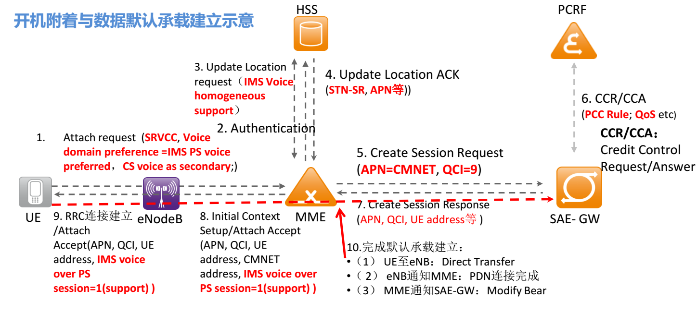

**IMS信令默认承载建立**
终端识别网络支持VoLTE，将在完成EPS附着后，向网络収起IMS APN默认承载建立请求，并从P-GW获得SBC/P-CSCF的IP地址。IMS信令默认承载建立过程在用户拜访省LTE网络完成。
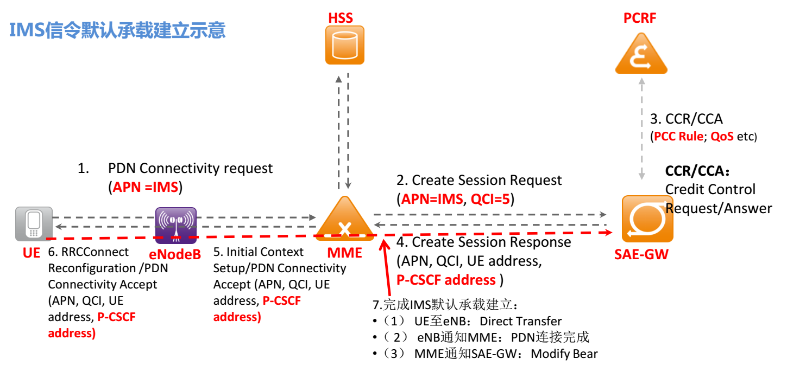

**IMS注册**
终端在收到网络回复的SBC IP地址后，将収起IMS域注册请求，消息中包含根据USIM卡导出的IMPI及对应的IMPU；
VoLTE终端的IMS注册流程収生在UE和IMS网络间，通过IMS信令默认承载疏通，eUTRAN、 EPC网络是一个透明的传递网络；
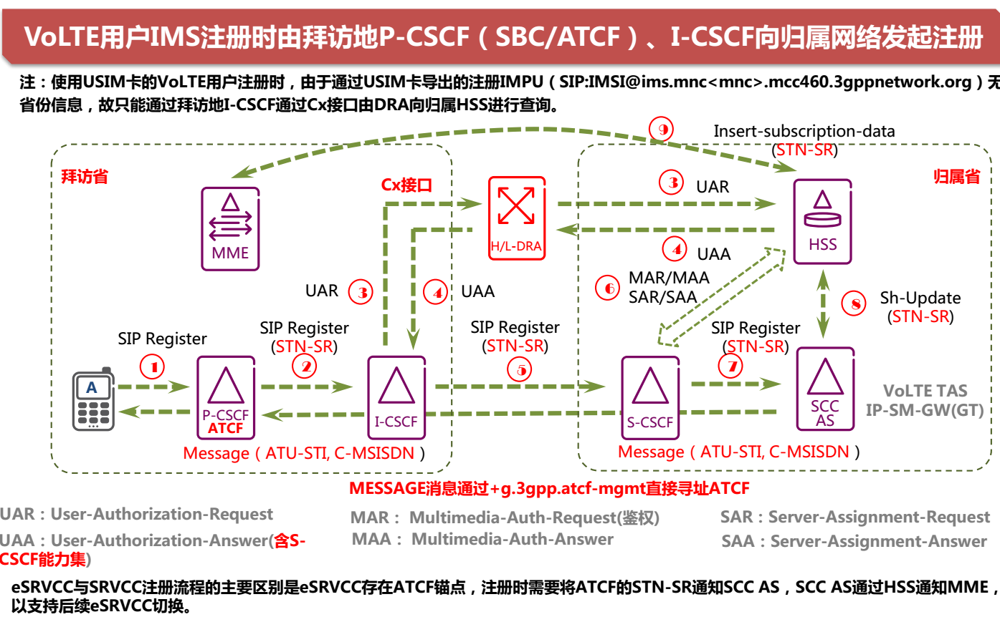

### 2.2.2 VoLTE基本呼叫流程
VoLTE呼叫路由控制总体由IMS域完成，基本控制流程与VoBB类似，但是由于VoLTE用户的无线接入与移动特性，新增了以下特定的控制流程：
+ 基本VoLTE：新增取VoLTE用户位置流程、专用承载建立流程；
+ 特定场景：新增被叫锚定流程、被叫域选择流程、eSRVCC切换流程；

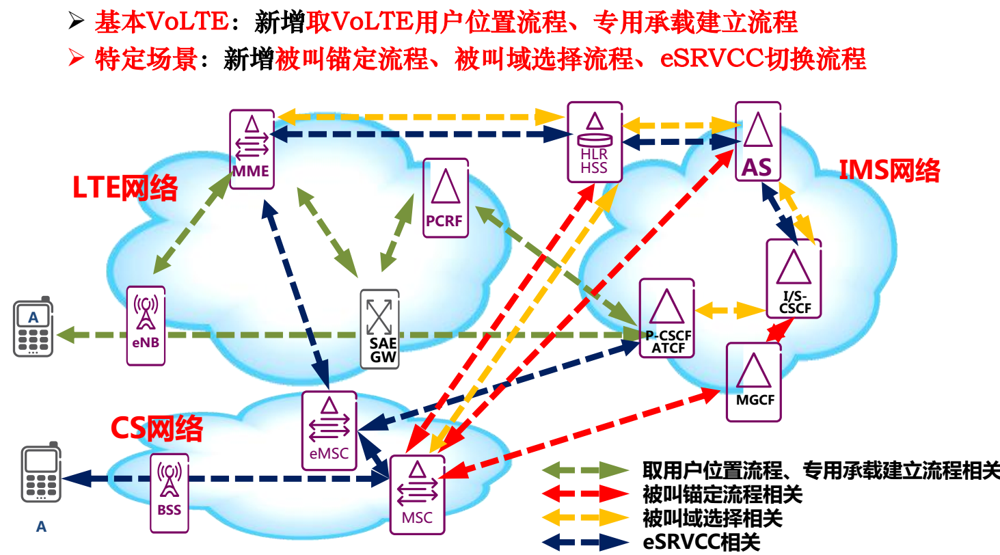

**取用户位置**
由于VoLTE终端有漫游等移动特性，当一个SBC负责多个本地网业务时，网络需要知道当前用户拜访网络的具体信息，以确定用户是否发生漫游并进行漫游计费。
部分拨号场景需要根据用户拜访区域补全区号，例如用户漫游按照拜访地拨号规则，拨拜访地固话时无需拨打区号，若不带用户当前拜访位置信息，则IMS由归属地AS按归属地区号进行补全，会导致呼叫失败或者错误接通。此外，部分短号码呼叫需要根据用户位置信息决定是否需要补全区号并接通。
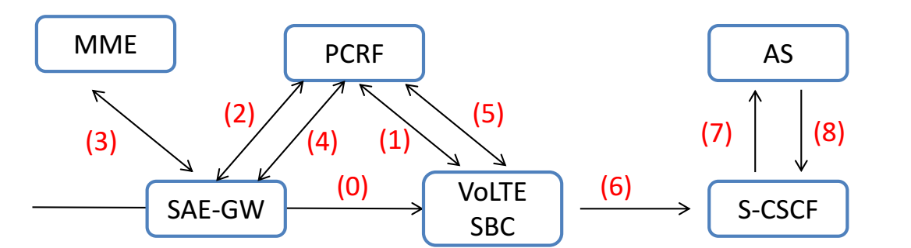
主要流程：
0：SBC收到来自终端的INIVTE消息；
1：SBC向PCF发送AAR携带Required-Access-Info的AVP；
2：PCRF向SAE-GW发送RAR携带Requireed-Access-Info；
3：SAE-GW向MME发送Create Bearer Request，MME在响应中携带UE的E-CGI/TAI；
4：SAE-GW向PCRF发送CCR，携带UE的E-CGI/TAI；
5：PCRF向SBC发送RAR，携带UE的E-CGI/TAI；
6：SBC查询本地配置（TAI与区号的配置），将TAI映射为区号，添加在SIP消息中；
7：INVITE消息转发到AS；
8：AS根据预设逻辑进行后继处理；

**专用承载建立**
IMS与用承载建立流程： VoLTE终端发起呼叫时，P-CSCF根据业务类型（语音、视频）经Rx接口向PCRF（Policy and Charging Rules Function）发起请求，PCRF根据策略通知SAE-GW建立VoLTE媒体与用承载。 专用承载建立后才会进一步完成后续呼叫流程。
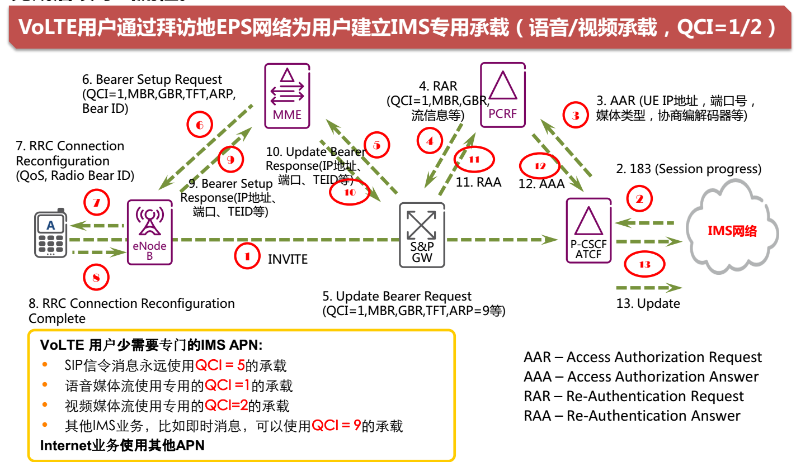

**VoLTE路由选择**
当主被叫均为VoLTE用户、且均附着在LTE网络时，呼叫控制将由IMS网络控制完成。由于IMS采用归属域服务原则，因此主被叫均由其归属网络IMS核心网及AS业务平台提供业务控制。
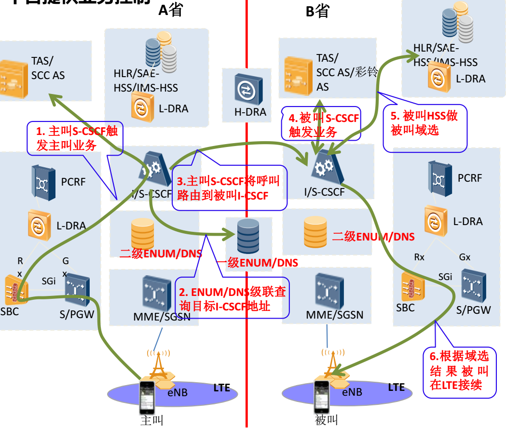
关键流程：
1 主叫网络根据主叫iFC触发业务至主要归属TAS和SCC-AS；
2 主叫S-CSCF经过ENUM/DNS级联查询，获取被叫用户归属IMS网络I-CSCF地址；
3 主机S-CDCF将呼叫路由到被叫归属网络I-CSCF，I-CSCF查询HSS活动服务S-CSCF并将呼叫送S-CSCF；
4 被叫S-CSCF根据iFC触发依次触发TAS、彩铃、SCC-AS；
5 被叫域选：HSS根据PS和EPC注册情况判断被叫当前所在接入域；
6 接续被叫；

## 2.4 关键技术
### 2.4.1 被叫锚定
**锚定（Anchoring）**：指将呼叫从CS网络路由到IMS网络进行业务处理的过程。实现锚定的目的是为了实现VoLTE用户补充业务体验到一致性。

中国移动采用的是主叫不锚定、被叫锚定到IMS域的策略：
+ 主叫不锚定：主叫补充业务较少，业务一致性问题不突出；主叫锚定网络效率低，特别是主叫多数不存在一致性问题任全部迂回IMS域，浪费资源，且呼叫时延增加1～3秒；
+ 被叫锚定：VoLTE 除了提供高清音视频呼叫等基础业务外，还需继承2/3G业务体验，为用户提供呼叫等待、呼叫保持、呼叫转移、号码显示、多方通话等补充业务，业务一致性问题突出，需统一锚定至IMS域进行业务处理；

**被叫锚定**
TAS内置锚定SCP功能，VoLTE用户开户时在HLR/HSS中签约T-CSI信息。当VoLTE驻留在2/3G且做被叫时，（G）MSC根据T-CSI触发到锚定SCP并获取IMRN，（G）MSC根据IMRN将呼叫路由到IMS域。
该方案可解决被叫业务一致性问题，但主叫业务仍采取双域触发，可能存在业务一致性风险，但鉴于目前主叫侧的补充业务应用非常少，将采取限制用户不能设置OCB等主叫业务的市场策略。
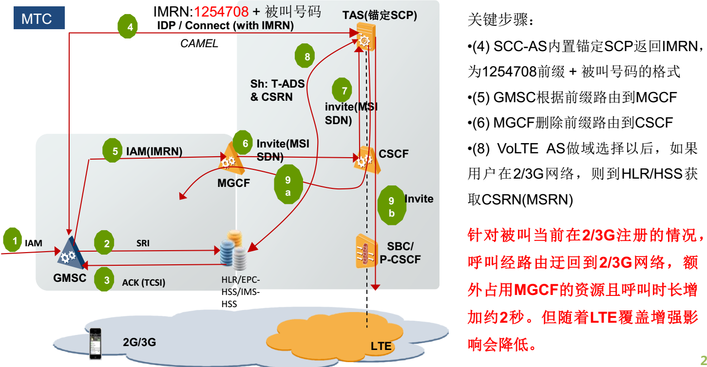

### 2.4.2 被叫域选择
**什么叫域选择**：由于支持VoLTE的终端可以有多种模式，在不同的信号强度覆盖下可以附着在不同的网络，如有时附着在2/3G网络，有时附着在LTE网络。因此，支持VoLTE的终端在呼叫时就要选择接入其中一个网络进行语音通话，选择接入网络的过程就称为域选。
**如何完成域选**：
+ 用户主叫时，终端根据保存的注册网络信息及自身的设置完成域选择；
+ 用户被叫时，由网络侧TAS、融合HLR/HSS等网元配合完成被叫域选择；

由于VoLTE被叫业务统一锚定到IMS域处理，因此被叫域选择功能由IMS域完成，由SCC AS中的T-ADS模块发起、联合三融合HSS/HLR根据用户注册状态等信息完成。

**被叫域选择流程**
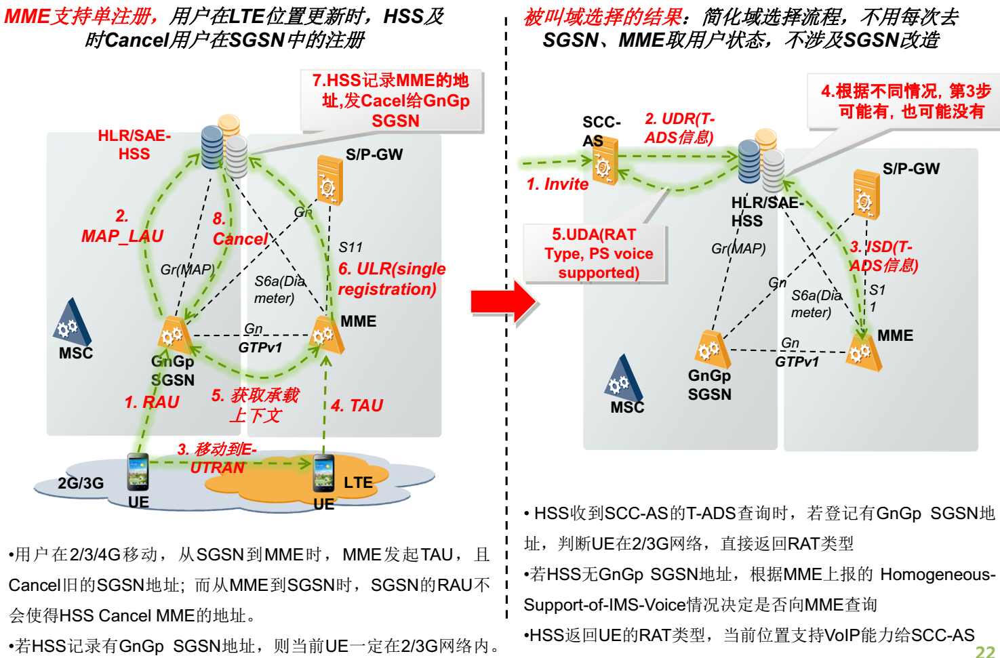

优化后的被叫域选择方案网络改造点
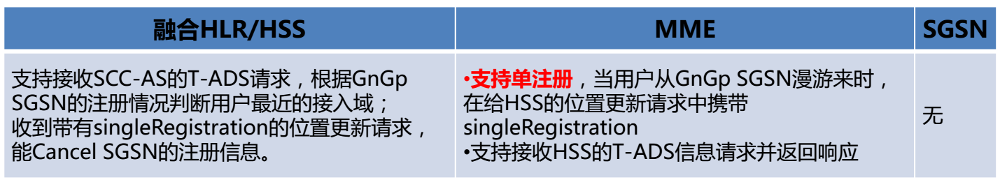

**被叫域选择的判断逻辑**
T-ADS综合HSS返回的用户当前附着网络、网络侧支持VoLTE的能力等因素，决定域选择结果：
+ 只要有PS注册（包括只有PS注册和PS/EPS双注册两种情况），选CS；
+ 只要有EPS注册，根据之前MME上报的支持VoLTE信息，查MME用户状态：
    - MME有用户附着、且终端支持SRVCC（VoLTE终端），选IMS；
    - MME无用户附着或终端不支持SRVCC，选CS；
+ PS/EPS都未注册，选CS；

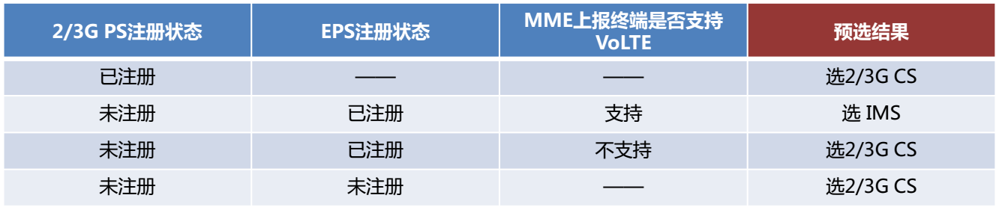
### 2.4.3 eSRVCC
SRVCC（Single Radio Voice Call Continuity）是LTE全覆盖之前语音从LTE到2/3G的切换方案，以实现在IMS控制下将基于LTE接入的话音切换到2/3G，满足用户通话过程中漫游出LTE覆盖区的通话连续性。
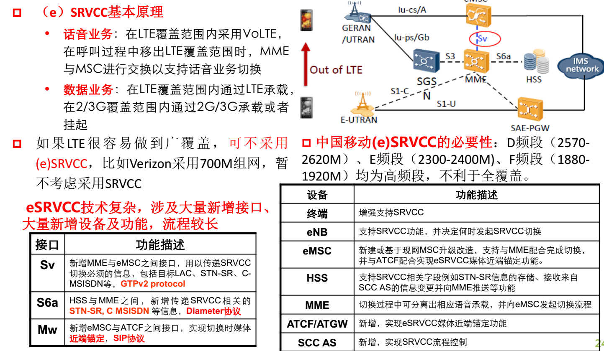

eSRVCC是SRVCC的增强版本，SRVCC在媒体变更时需要经IMS域进行远端媒体面协商与切换，而eSRVCC不涉及，因此切换过程中的中断时间缩短（保证少于300ms），性能得以优化。二者均为国际规范，中国移动采用eSRVCC技术。

**eSRVCC的注册流程**
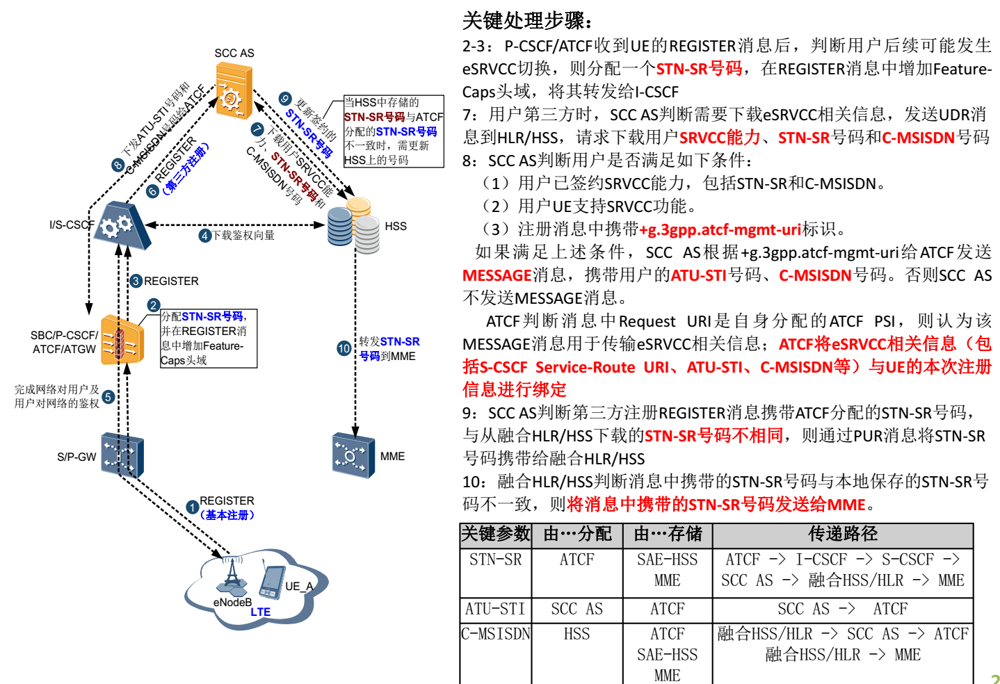

**eSRVCC的切换流程**
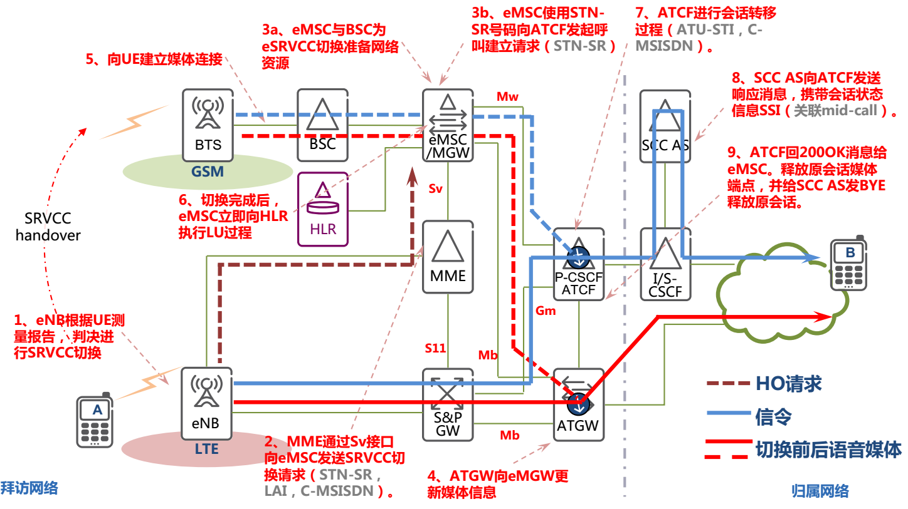

# 3 各环节改造内容
## 3.1 用户SIM卡与终端
采用TD-LTE用户不换卡、不换号、更换终端并登记使用VoLTE的业务发放策略。用户感知的号码没有变化，业务开通时钟HSS为每个用户写入4个IMS号码：
+ 终端导出2个：1个IMPI、1个与之对应的IMPU（SIP URI），用于注册；
+ 网络下发2个：2个IMPU（Tel URI和SIP URI），用于呼叫，注册完毕后下发到终端；

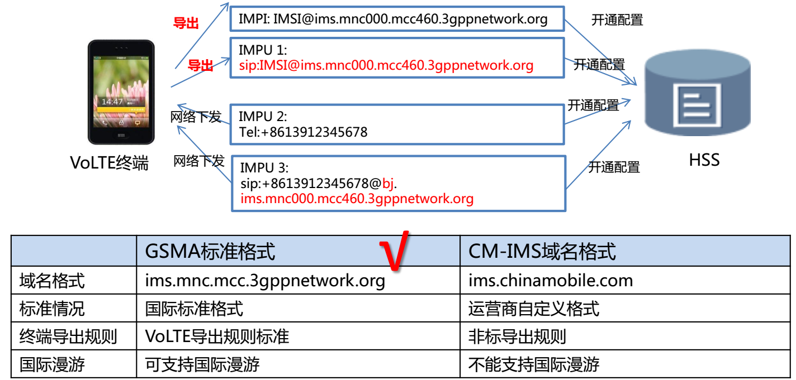
## 3.2 无线网
**4G无线网**：需要支持SRVCC基本功能，以及为保障无线IP环境下的语音通信质量，将引入针对VoLTE的无线网增强功能：
+ 小区边缘QoS保障（TTI Bundling，容量换质量），通过最大连续使用4个TTI资源数，提供小区边缘UE增益（仿真提高4db）；
+ 头压缩（Robust header compression）：语音数据包大小固定且比较小（32Bytes），但包头开销大（40Bytes），导致资源利用效率很低，通过RoHC将头压缩至6Bytes，提升资源利用效率；
+ 半静态调度（SPS）：在LTE系统中，对于小数据量的VoIP应用，制约系统容量的因素不是系统带宽，而是控制信道的容量，SPS（Semi-Persistent Scheduling）将资源周期性（20ms）分配给特定UE，具有一次分配、多次使用的特定，以降低对应控制信道（PDCCH）的开销；

**2G无线网**：支持小区空闲态重选返回4G功能，配置重选相关参数；
## 3.3 DRA信令网组织与调整

VoLTE语音方案下，DRA信令网需要新增以下功能：

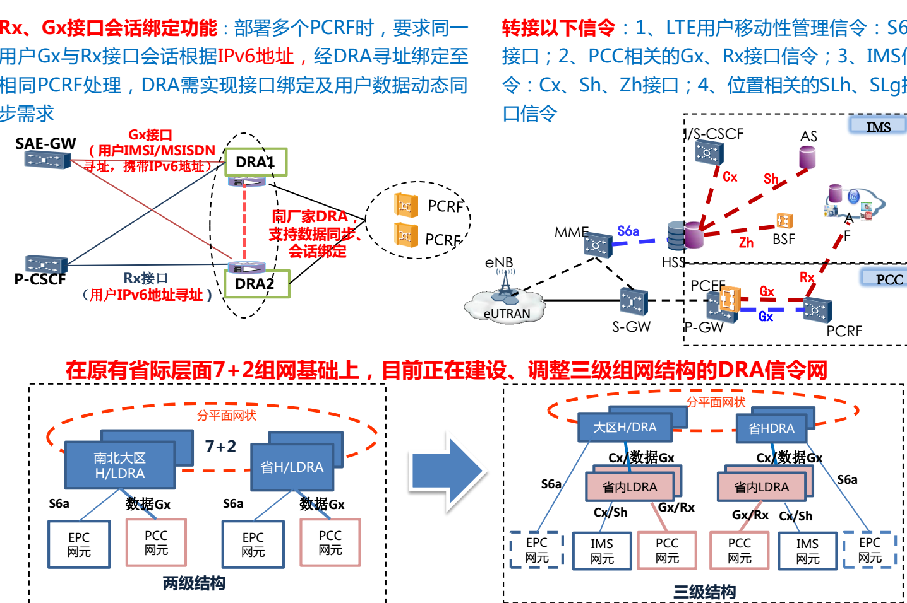
## 3.4 HLR/HSS用户数据融合
VoLTE需要在现网HLR/EPS-HSS二合一融合设备的基础上引入IMS-HSS功能，实现HLR、 EPC HSS、IMS HSS三融合设备。
VoLTE业务的引入，对HSS新增如下功能：
+ IMS-HSS功能：支持IMS网络鉴权、注册、用户数据存储和下放功能，支持2/3/4G/IMS数据统一存储；
+ T-ADS功能：支持VoLTE用户被叫域选择功能，根据HSS存储的用户注册状态及MME查询结果，正确返回VoLTE被叫接入域；
+ 智能网位置查询：支持SCP通过ATI消息查询用户4G及2/3G位置信息；
+ eSRVCC：支持SRVCC能力、STN-SR（Session Transfer Number for SRVCC）动态存储和查询功能，支持SRVCC能力、STN-SR在S6a和Sh接口的传递；
+ IP短消息：支持与 IP-SM-GW之间Sh接口和J接口，支持IP-SM-GW到HSS的IMSI、 MSISDN、 IMPU等信息的查询。支持接收幵处理来自IPSM-GW的SRI请求：当HSS接收到SRI请求时，可根据用户登记的相关IPSM-GW地址信息进行判断，如请求来自短信中心，需支持将SRI请求转収至对应IP-SM-GW；如请求来自IP-SM-GW，需迒回对应的MSC/SGSN地址及对应IMSI；
+ 紧急呼叫；
+ 禁止VoLTE用户电路域修改补充业务；

## 3.5 CS核心网的要求
为支持eSRVCC切换流程，需要在EPC与CS域间开通Sv接口，以传递系统间切换需要的信息，并实现电路域“切换目标MSC”与IMS SBC近端锚点之间的桥接，需要现网改造或新建eMSC支持这些功能：
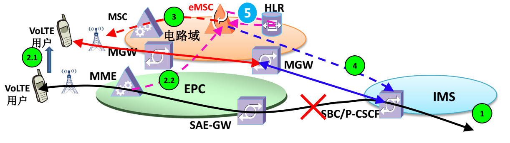
1 VoLTE在LTE中已经建立话路；
2 发生至2/3G的切换，MME通过Sv接口通知eMSC；
3 eMSC根据Target ID找到切换目的MSC；
4 根据STN-SR找寻址SBC/P-CSCF/ATCF；
5 eMSC接管业务后，向用户归属HLR执行位置更新；

## 3.6 LTE核心EPC
作为VoLTE语音方案中关键的信令和语音承载通道，EPC网络除了要支持前面提到的网络VoLTE能力指示下发、eSRVCC、IMS PDN连接创建和语音专用成长建立等基础功能，配合PCC网元完成用户位置提取、计费要素传递功能外，还需要提供以下增强型功能：
+ P-CSCF发现：按策略通过PCO信元向终端发布P-CSCF地址，实现P-CSCF负责均衡；

+ 跨省切换重建IMS PDN连接：避免VoLTE用户漫游出省时被叫号码不全失效，且用户语音路径迂回；

+ PGW带宽向上取整：避免终端因带宽不足导致业务不能接通；

  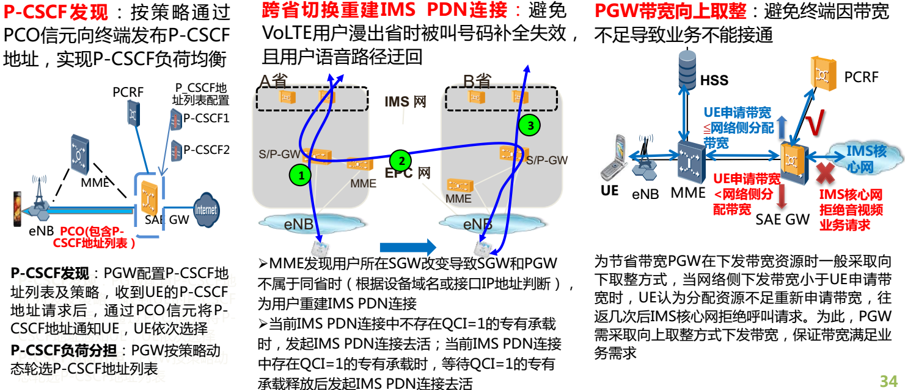

## 3.7 PCC在VoLTE中发挥的主要作用
PCC在VoLTE语音方案中的核心作用是QoS保障，即通过PCC机制建立IMS PDN默认和专业承载传递IMS信令和音视频。此外，作为接入控制网络EPC和应用控制网络IMS之间的桥梁，PCC同时实现接入网络相关消息（位置信令和计费要素）的传递功能。

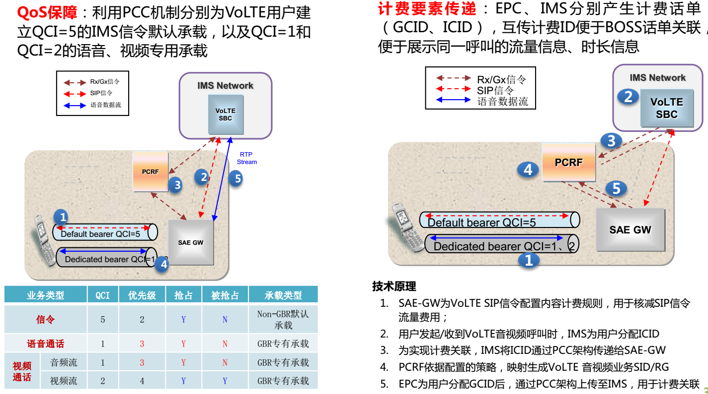
## 3.8 VoLTE IMS核心网
中国移动现有全网部署CM-IMS网络，主要为固定用户提供业务；VoLTE语音需要IMS作为核心控制网络为用户提供高清语音和视频，为了充分利用现有网络，同时考虑VoLTE业务移动性、两网用户业务需求、网元功能差异，采用CM-IMS、VoLTE IMS部分融合方案：
+ 功能差异较大的SBC/P-CSCF（需要支持eSRVCC锚定）、HSS（实现三融合）和AS（锚定、被叫域选择等）独立建设；
+ 功能类似或改造量不大的例如CSCF、ENUM/IM-MGW等网元两网公用；
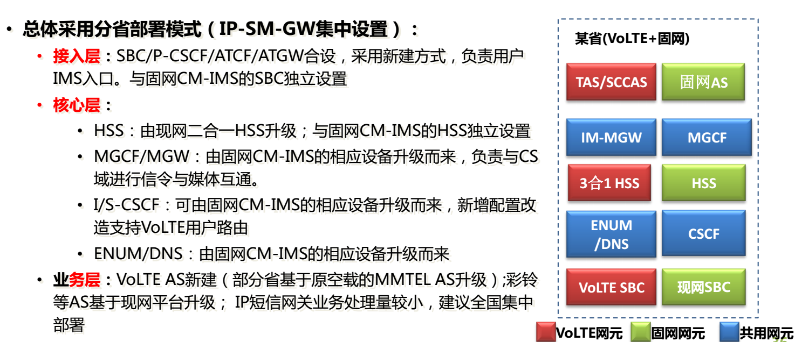
## 3.9 VoLTE业务平台
现阶段共涉及新建或改造以下7种与VoLTE相关的业务平台：
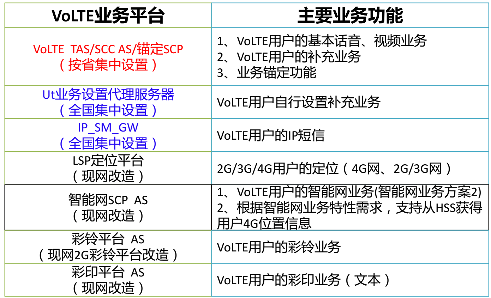

## 3.10 承载网要求
为规避IPv4地址资源匮乏问题，VoLTE业务要求使用IPv6地址。相关承载网需要进行以下改造：
+ VoLTE终端：LTE数据采用IPv4/v6双栈，VoLTE采用IPv6单栈；
+ P-CSCF/SBC与SAE-GW通过IPv6 VPN连接，SBC支持IPv4/v6转换；
+ IP专网支持IPv6：PE路由器升级支持6vPR，VPN RR支持IPv6路由反射，开通VoLTE SGi VPN，CE支持IPv4/v6双栈；
+ 现阶段IMS核心网设备内部保持IPv4；

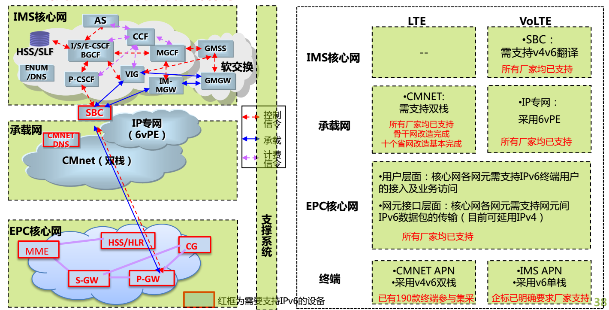

## 3.11 支撑系统改造

全网各省BOSS改造支持HSS、VoLTE AS和ENUM/DNS的业务开通接口，以及VoLTE AS/PGW等网元话单出来及在线计费接口，满足VoLTE用户业务开拓和计费功能；
总部一级网管及各省网管系统均需要进行相应升级改造，满足功能管理和统计、安全等要求。
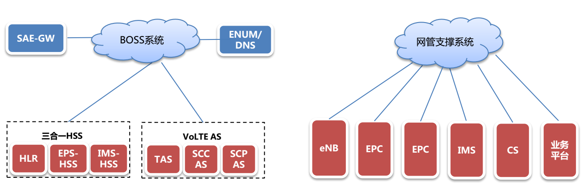